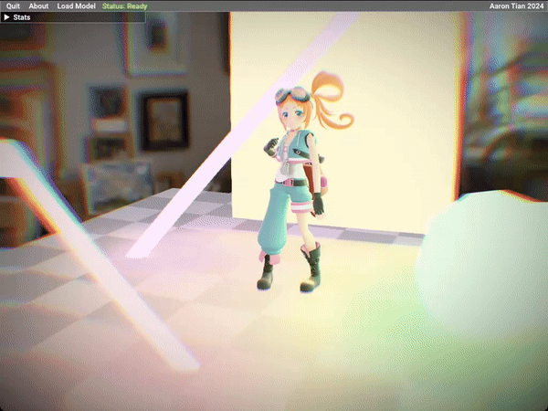
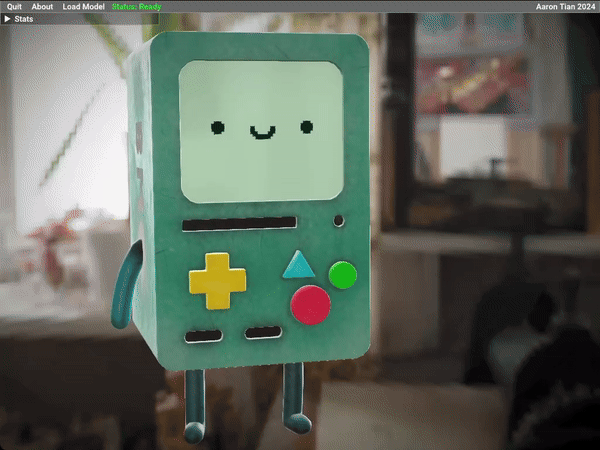
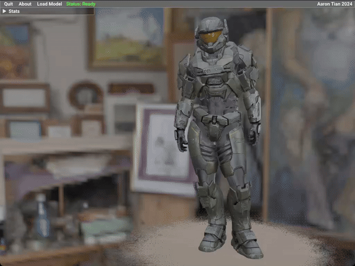
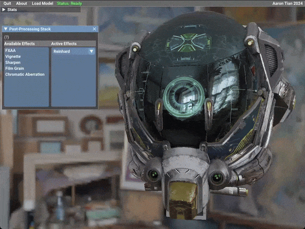

# qhenki Vulkan Renderer

My personal hobby renderer written in C++ using Vulkan. It is intended as a place for me to implement various graphics techniques in a modern API. The renderer is actively being built with new features.

## Table of Contents
- [Showcase](#showcase)
- [Features](#features)
- [Future Features](#future-features)
- [Stretch Goals](#stretch-goals)
- [Dependencies](#dependencies)
- [Model Credits](#model-credits)
- [Technical Details](#technical-details)
- [References](#references)

## Showcase

<table border="1">
  <tr>
    <td colspan="2" align="center"><b>Dynamic Area Lights</b></td>
  </tr>
  <tr>
    <td></td>
  </tr>
</table>

<table border="1">
  <tr>
    <td colspan="2" align="center"><b>Compute Shader Skinning and Animation</b></td>
  </tr>
  <tr>
    <td></td>
    <td></td>
  </tr>
<tr>
    <td></td>
    <td></td>
  </tr>
</table>

<table border="1">
  <tr>
    <td colspan="2" align="center"><b>Post-Processing Stack</b></td>
  </tr>
  <tr>
    <td></td>
  </tr>
</table>

<table border="1">
  <tr>
    <td colspan="2"></td>
  </tr>
  <tr>
    <td></td>
    <td></td>
  </tr>
</table>

## Features

* Deferred Rendering
  * Albedo, Normal, Metal/Roughness/Ambient Occlusion, and Emission
  * Implemented entirely using Vulkan Subpasses: Tiled-based renderer friendly
  * Position reconstructed from depth
  * Supports transparency
* PBR Pipeline
  * Metallic/Roughness Cook-Torrance BRDF
  * Dynamic Area Lights
    * Sphere, tube, rectangle lights
  * Image-based lighting using environment maps
    * Generated offline and loaded as `dds` files
* Compute Shader Mesh Skinning
  * Skinning matrix calculations are done on the GPU
* Bindless Textures
  * Bind up to [4294967295 textures](https://vulkan.gpuinfo.org/displaydevicelimit.php?platform=windows&name=maxPerStageDescriptorSamplers) in one draw call depending on your hardware. Limited to 80 to maintain compatibility on macOS
* Asynchronous Model Loading
  * Models are loaded on multiple separate threads. Vertex/texture data is created with a dedicated transfer queue (if your GPU has one)
* Multithreaded command buffer generation
  * Older APIs such as OpenGL require that GPU work be recorded/submitted from one thread (with workarounds such as shared contexts). I take advantage of Vulkan's exposure of command buffers by using multiple threads to speed up tasks such as loading environment maps
* Post-processing Stack
  * Apply a variety of configurable post-processing shaders an arbitrary number of times in any order
    * FXAA
    * Vignette
    * Sharpen
    * Film Grain
    * Chromatic Aberration
  * Multiple selectable tone mapping operators
    * Reinhard
    * Khronos PBR Neutral
    * ACES
* Tangent Space Normal Mapping
  * Tangent vectors are automatically computed by the application using the [MikkTSpace](http://www.mikktspace.com/) standard (assuming the model doesn't already have them)
* ImGUI Integration
  * GUI to change renderer settings and load models

## Future Features
- [x] ~~Dynamic Lights~~ [#16](https://github.com/AaronTian-stack/qhenki-renderer/pull/16)
  - Sphere, tube, and rectangle lights
- [x] ~~Compute Skinning and Skeletal Animation~~ [#17](https://github.com/AaronTian-stack/qhenki-renderer/pull/17)
- [ ] High Quality Bokeh Depth of Field (physically based)
- [ ] Physically Based Bloom
- [ ] Volumetric Lighting
- [ ] Screen Space Reflections
- [ ] Shadow Atlas System

## Stretch Goals
Features I want to implement eventually:
- [ ] Tiled Deferred Rendering
- [ ] Indirect draw, GPU compute culling
- [ ] GTAO
- [ ] Temporal Anti-Aliasing
- [ ] Ray Tracing

## Dependencies
* [GLFW](https://github.com/glfw/glfw) - zlib License
* [GLM](https://github.com/g-truc/glm) - MIT License
* [vk-bootstrap](https://github.com/charles-lunarg/vk-bootstrap) - MIT License
* [VulkanMemoryAllocator](https://github.com/GPUOpen-LibrariesAndSDKs/VulkanMemoryAllocator) - MIT License
* [ImGUI](https://github.com/ocornut/imgui) - MIT License
* [ImGuiFileDialog](https://github.com/aiekick/ImGuiFileDialog) - MIT License
* [MikkTSpace](https://github.com/mmikk/MikkTSpace)
* [TinyGLTF](https://github.com/syoyo/tinygltf) - MIT License
* [tinyobjloader](https://github.com/tinyobjloader/tinyobjloader) - MIT License
* [SPIRV-Cross](https://github.com/KhronosGroup/SPIRV-Cross) - Apache 2.0 License
* [dds-ktx](https://github.com/septag/dds-ktx) - BSD 2-Clause License
* [gdx-vfx](https://github.com/crashinvaders/gdx-vfx) - Apache 2.0: Not used directly but the post processing shaders are based on the ones from this repo.
* [robin-map](https://github.com/Tessil/robin-map) - MIT License

Offline tools [glslc](https://github.com/google/shaderc/tree/main/glslc), [cmftStudio](https://github.com/dariomanesku/cmftStudio), and [Blender](https://www.blender.org/) are used.

## Model Credits

Included in repo:

| Asset            | Link                                                                                                                   | License                         |
|------------------|------------------------------------------------------------------------------------------------------------------------|---------------------------------|
| Damaged Helmet   | [Github](https://github.com/KhronosGroup/glTF-Sample-Models/tree/main/2.0/DamagedHelmet)                               | CC Attribution - Non-commercial |

Models featured in screenshots:
  - [Apple Vision Pro](https://sketchfab.com/3d-models/free-apple-vision-pro-ultra-high-quality-8bd7123015ee4509b1c312f54a877597)
  - [Salty Snack](https://sketchfab.com/3d-models/salty-snack-firearm-game-ready-702411980d904abc974efef9ba4e47d5)
  - [Copper Tea Pot](https://sketchfab.com/3d-models/copper-tea-pot-27f2ac58f7614f2796630bdc6f18ee2f)
  - [Crytek Sponza](https://github.com/KhronosGroup/glTF-Sample-Models/tree/main/2.0/Sponza)
  - [Tarisland Arachnida](https://sketchfab.com/3d-models/tarisland-arachnida-d9aacbf0a2a44899b0e4b3de0d0c66bd)
  - [Pico Chan](https://sketchfab.com/3d-models/pico-chan-80923daa339348858c1291a2969c9b10)
  - [BMO](https://sketchfab.com/3d-models/bmo-realistic-5d8a3f209118401da46e3b1b38903961)
  - [Spartan Armour MKV - Halo Reach](https://sketchfab.com/3d-models/spartan-armour-mkv-halo-reach-57070b2fd9ff472c8988e76d8c5cbe66)

## Technical Details
Uses Vulkan 1.2 (SDK 1.3.283) with only core features. Built using CMake and C++17. Runs on Windows and macOS (MoltenVK).

# References
- https://vulkan-tutorial.com/
- https://vkguide.dev/
- https://www.intel.com/content/www/us/en/developer/articles/training/api-without-secrets-introduction-to-vulkan-part-1.html
- https://learnopengl.com/
- https://kylehalladay.com/blog/tutorial/vulkan/2018/01/28/Textue-Arrays-Vulkan.html
- https://blog.selfshadow.com/publications/s2013-shading-course/karis/s2013_pbs_epic_notes_v2.pdf
- https://seblagarde.wordpress.com/wp-content/uploads/2015/07/course_notes_moving_frostbite_to_pbr_v32.pdf
- https://iquilezles.org/articles/filterableprocedurals/